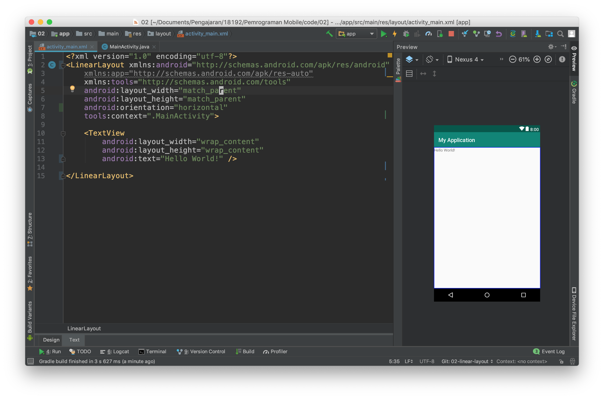
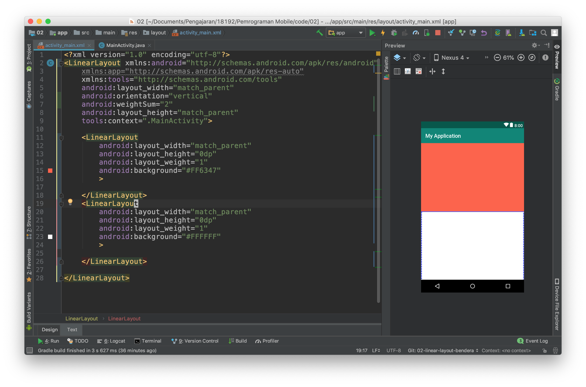
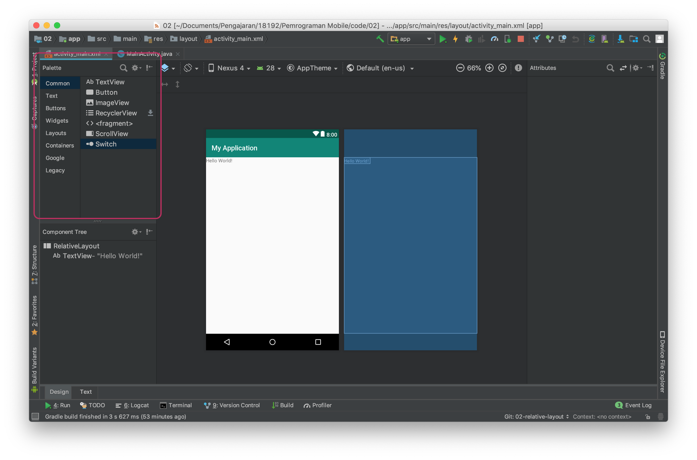
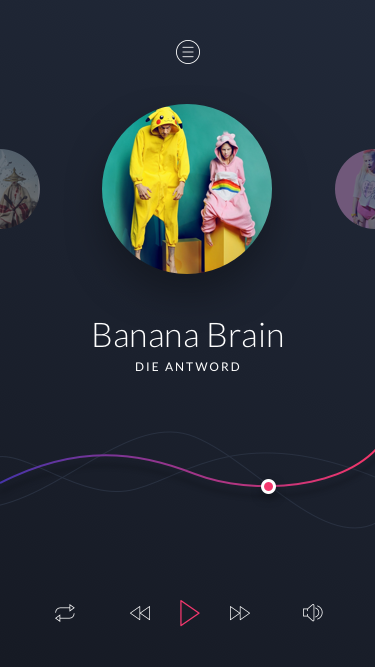

# Pendahuluan
Pada praktikum kali ini anda akan mempelajari teori mengenai beberapa layout populer pada pengembangan aplikasi android.

## Pengetahuan yang harus dimiliki
1. Membuat project android
2. Activity Lifecycle
3. Fragment Lifecycle

## Yang akan anda pelajari / lakukan
1. Membuat android xml layout linear layout
2. Membuat android xml layout relative layout
3. Membuat android xml layout constraint layout

## Alat dan bahan
1. Clone starter code : [Starter Code Chapter 2](https://github.com/polinema-mobile/dtschapter02-starter)
2. Perhatikan folder “design” pada starter code untuk melihat layout yang akan dibuat.

# Membuat aplikasi dengan linear layout
- Buatlah kembali sebuah project baru dengan konfigurasi yang disesuaikan dengan kebutuhan anda seperti pada langkah praktikum sebelumnya.
- Bukalah file `activity_main.xml` kemudian buka dengan menggunakan design mode.

- Kemudian lakukan konversi view dari constraint layout ke lineear layout.

- Kemudian gantilah design mode ke text mode.

- Tambahkan properties `android:orientation="vertical"` pada tag `LinearLayout`

Anda baru saja menambahkan atrribut baru pada tag xml, ada banyak properties lain yang perlu anda ketahui silahkan melakukan explorasi untuk properties atribut lain.

- Selanjutnya tambahkan properties background pada linear layout seperti pada gambar dibawah ini sehingga layout anda berubah background nya menjadi hijau.

- Kemudian ubahlah nilai dari properties `layout_height` menjadi wrap_content

- Lakukanlah kompilasi kemudian simpulkan apakah perbedaan antara `wrap_content` dan `match_parent`

Selain properties diatas linear layout mempunyai properties khusus yang hanya ada pada tipe layout ini, yaitu `weigth_sum` dan `layout_weight`

- weight_sum adalah bobot yang diberikan kepada LinearLayout bobot ini nantinya dapat digunakan untuk membagi ukuran yang dapat dimiliki oleh child dari LinearLayout.
- layout_weight adalah bobot yang diberikan kepada child dari LinearLayout untuk menentukan ukuran dari child ini pada layar.

Untuk memahami penggunaannya lakukan langkah percobaaan berikut ini :

- Buka kembali project sebelumnya, kemudian kembalikan `layout_height` ke `match_parent`, juga hapus properties background seperti pada gambar dibawah ini :

- Hapuslah tag xml TextView kemudian isilah LinearLayout dengan dua buah child lain yang juga sebuah LinearLayout hasilnya seperti pada gambar dibawah ini.

- Jika anda lihat belum terjadi perubahan apapun pada layout, untuk itu lanjutkan dengan menambahkan properties background, weight_sum dan layout_weight seperti pada gambar dibawah ini.

> kita dapat menggunakan LinearLayout sebagai child dari LinearLayout atau layout lain proses ini dinamakan nested layout

- Berdasarkan percobaan di atas lakukanlah perubahan-perubahan sebagai berikut kemudian ambillah kesimpulan dari percobaan ini.
  - ubah *orientation* menjadi horizontal
  - ubah *weight sum* menjadi angka integer yang lain
  - ubah *layout_weight* dari salah satu **LinearLayout**

# Membuat aplikasi dengan relative layout
- Selanjutnya untuk memahami relative layout kembalikan kode program pada activity_main.xml ke kondisi awal dan ubahlah *layout*-nya menjadi **relative layout**. Sehingga kode program dan tampilan berubah seperti gambar di bawah ini.

 > **RelativeLayout** adalah layout yang menempatkan suatu item relative terhadap parent atau item lain pada UI.

 - Untuk mencobanya tambahkan dua buah button pada layout anda bisa menambahkan dengan menggunakan pallet yang ada di sebelah kiri tampilan design kemudan jangan lupa menghapus TextView "hello world"

- Ubahlah teks dan lebar dari button sehingga menjadi seperti gambar di bawah ini.

> untuk mengubah bisa menggunakan text mode atau pada design mode dengan mengklik button dan mengganti properties di kanan editor.

- Selanjutnya ubahlah tampilan dengan mengubah kode program melalui text mode sehingga seperti gambar di bawah ini.

Perhatikan pada kode program tersebut sebuah item di posisikan pada layout dengan memberikan detail posisinya relative terhadap parent.

Pada *button* pertama ini mempunyai *properties*
- `android:layout_alignParentStart="true"`
- `android:layout_alignParentLeft="true"`
- `android:layout_alignParentTop="true"`

Dengan konfigurasi properties seperti di atas sebuah item akan diposisikan di sebelah kiri atas.

- untuk lebih memahami relative layout buatlah layout baru seperti pada gambar dibawah ini.

- Berdasarkan percobaan di atas cobalah membuat layout yang sebelumnya menggunakan *linear layout* dengan *relative layout*.

# Membuat Aplikasi dengan Constraint Layout

Constraint layout merupakan layout terbaru dari android, layout ini berbasis relative layout namun mempunyai tingkat kemudahan yang lebih baik dalam penggunaannya.

Penggunaan Constraint layout ini mirip dengan relative layout namun dengan kemudahan dalam mengoperasikannya karena sudah dapat digunakan dengan baik pada editor di design mode.

Setiap item pada constraint layout memiliki 4 arah constraint yaitu top, left, right, dan bottom. Ke empat arah ini terdapat sebuah connection source yang dapat ditarik ke *parent* atau ke objek lain. Perhatikan gambar di bawah ini.

Pada text view hello world terdapat 4 constraint dan masing masing constraint di hubungkan ke parent dengan mode panah bergerigi, panah bergerigi ini mewakili `wrap_content` pilihan lain selain wrap content adalah fixed dan match constraint. Silahkan mencoba dan berikan kesimpulan terhadap pengamatan dan percobaan ada mengenai hal ini.

- untuk mencoba silahkan kembalikan kode program pada `activity_main.xml` ke kondisi awal.
- Kemudian buatlah layout pada latihan LinearLayout menggunakan ConstraintLayout
  > Untuk membagi layout menjadi dua bagian gunakan guidelines.
- Selanjutnya buatlah layout pada latihan RelativeLayout menggunakan ConstraintLayout
  > Untuk membuat ini lebih cepat menggunakan design mode dan menarik constraint ke parent atau object lain.

# Latihan
Pada latihan kali ini silahkan anda belajar mengkonversi layout dengan desain dibawah ini

